# 第一章实验 基于 VirtualBox 的网络攻防基础环境搭建

 ## 实验目的

 * 掌握 VirtualBox 虚拟机的安装与使用；
 * 掌握 VirtualBox 的虚拟网络类型和按需配置；
 * 掌握 VirtualBox 的虚拟硬盘多重加载；

 ## 实验环境

 实验使用的网络节点和主要软件：

 * VirtualBox 虚拟机
 * 攻击者主机（Attacker）：Kali 2022.3
 * 网关（Gateway, GW）：Debian Buster
 * 靶机（Victim）：xp-sp3 / Kali

 ## 实验要求

 * 虚拟硬盘配置成多重加载；

 * 搭建满足如下拓扑图所示的虚拟机网络拓扑；

 


 * 完成以下网络连通性测试；
    - [x] 靶机可以直接访问攻击者主机
    - [x] 攻击者主机无法直接访问靶机
    - [x] 网关可以直接访问攻击者主机和靶机
    - [x] 靶机的所有对外上下行流量必须经过网关
    - [x] 所有节点均可以访问互联网

 ## 实验过程
 * 将虚拟硬盘配置成多重加载
 
 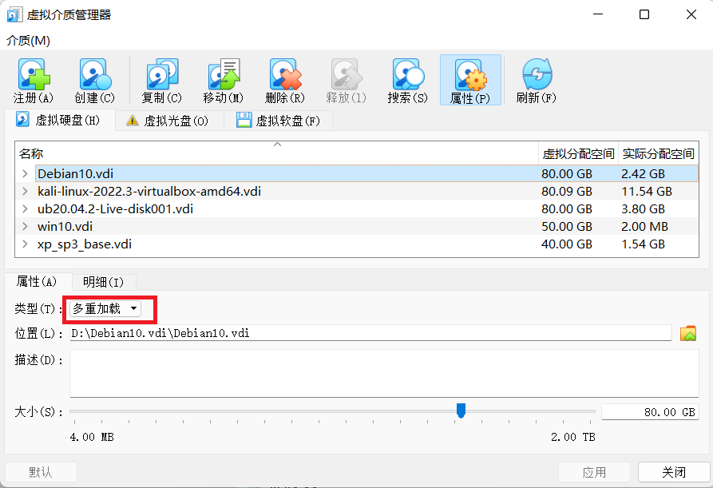
 * 搭建虚拟机网络拓扑；
  
 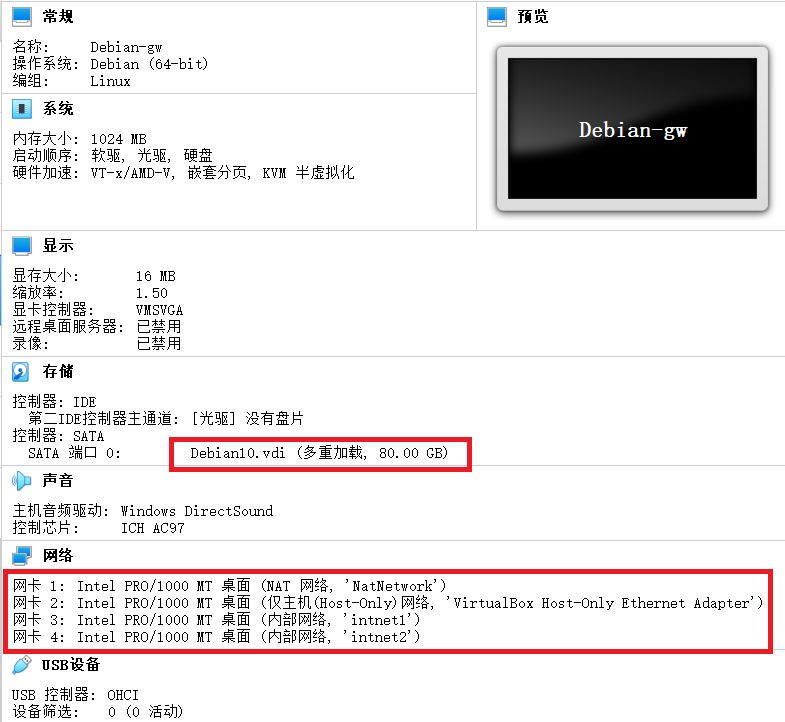  

 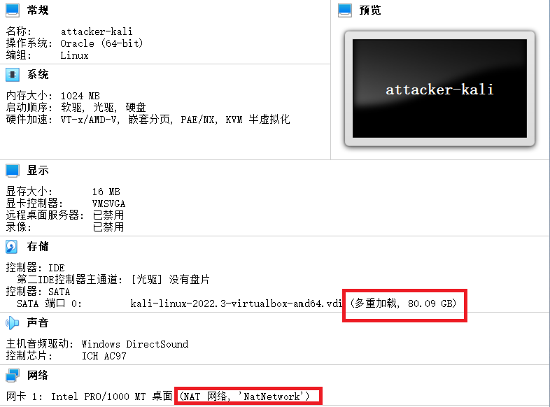  

 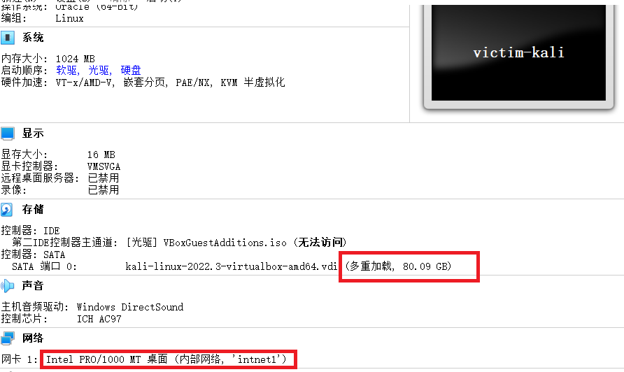  

 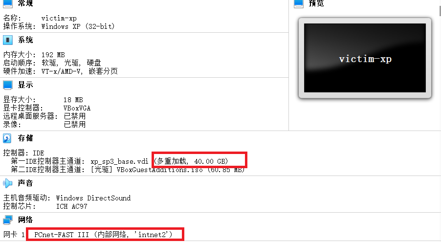  

 - 网关  
  
   网卡名称 | ip地址 
      :-    |:-
      enp0s3|10.0.2.15
      enp0s8|192.168.56.113
      enp0s9|172.16.111.1
      enp0s10|172.16.222.1
 - 靶机  
  
   靶机名称 | 网络类型 | ip地址
      :-      |:-       |:-
      Victim-xp1 |内部网络intnet1|172.16.111.134
      Victim-kali1 |内部网络intnet1|172.16.111.139
      Victim-xp2 |内部网络intnet2|172.16.222.115
      Victim-kali2 |内部网络intnet2|172.16.222.110 

 - 攻击者主机

   名称 | 网络类型 | ip地址
    :- |:- |:-
    attacker—kali |NAT 网络|10.0.2.4

 - 连通性测试  
   - 靶机可以直接访问攻击者主机   
 
   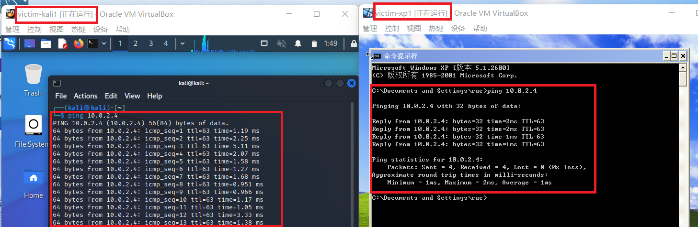  

   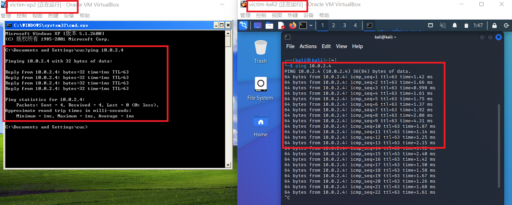  

   - 攻击者主机无法直接访问靶机    

   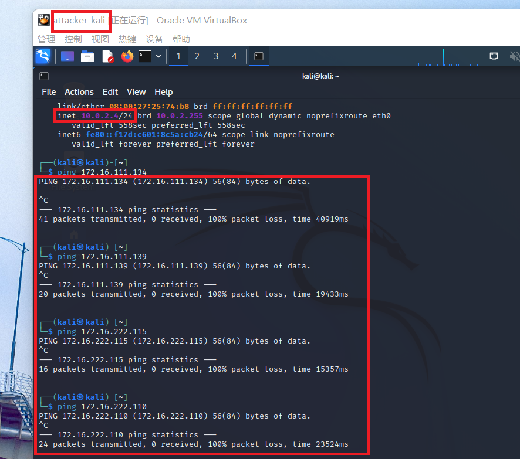    

   - 网关可以直接访问攻击者主机和靶机  
  
   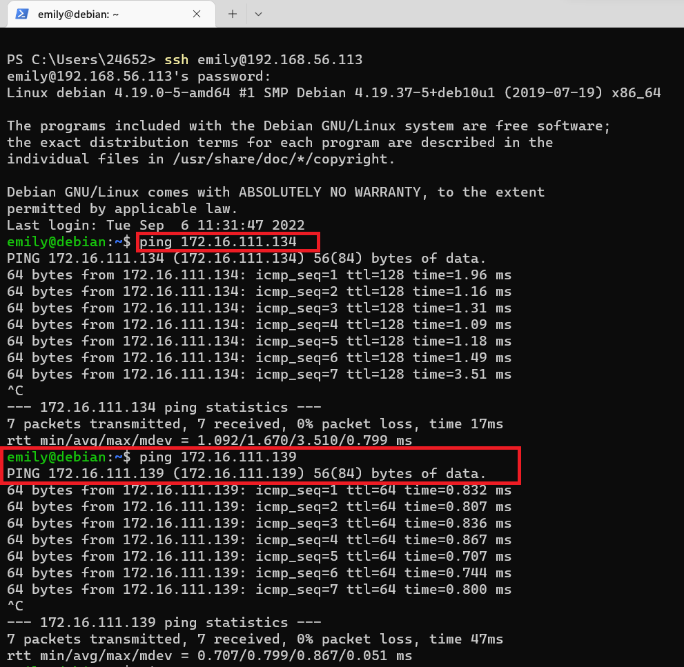    

   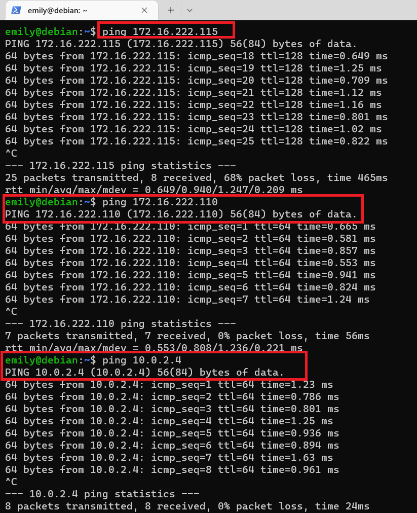    

   - 靶机的所有对外上下行流量必须经过网关
  首先在Debian执行：
   ```
   apt update  
   apt install tmux
   apt install tcpdump
   ``` 
   `tcpdump -i enp0s9 -n -w 20220961.pcap`  

       

   scp至本地，用wireshark打开    
    
   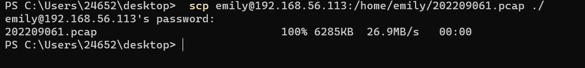  

   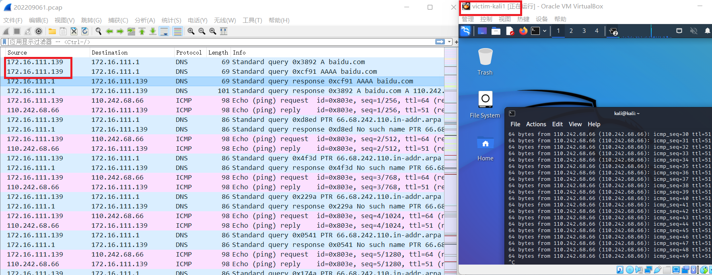  
     
   同理，对网卡enp0s10执行tcpdump进行抓包，如下所示：

   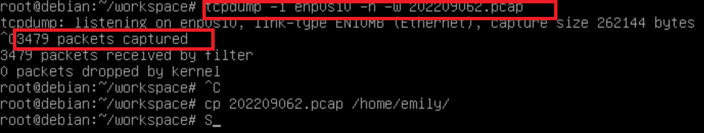   
     
   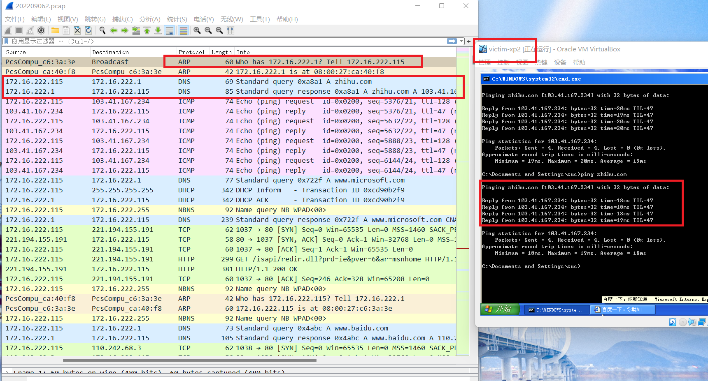    

   - 所有节点均可以访问互联网  

   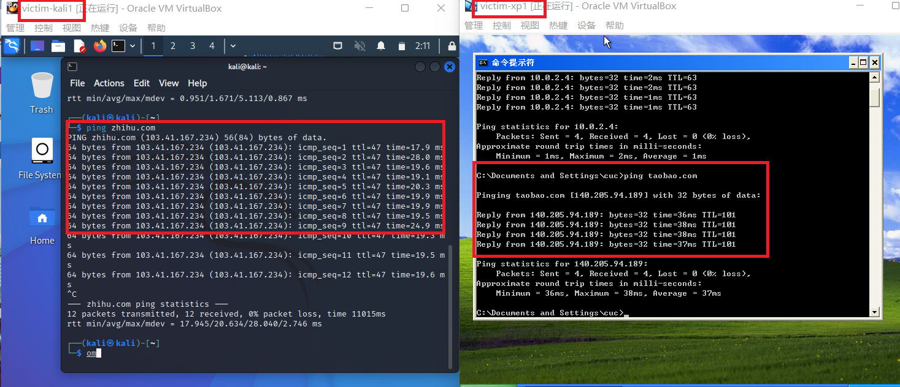   

   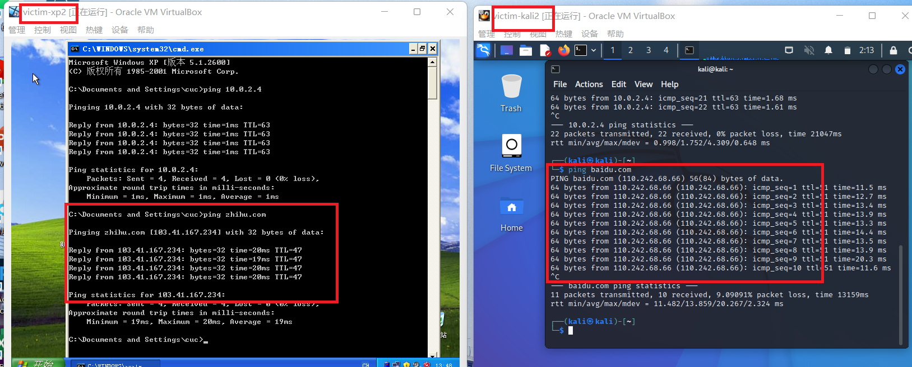   

   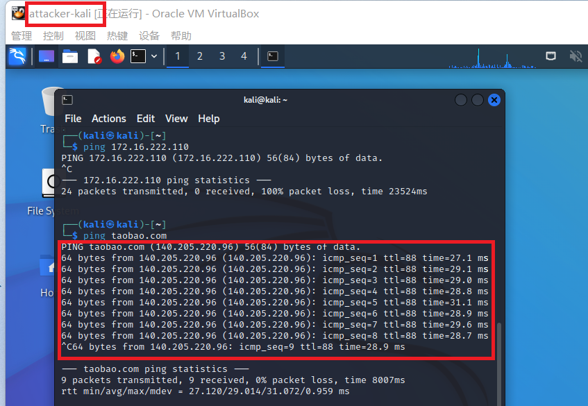   

   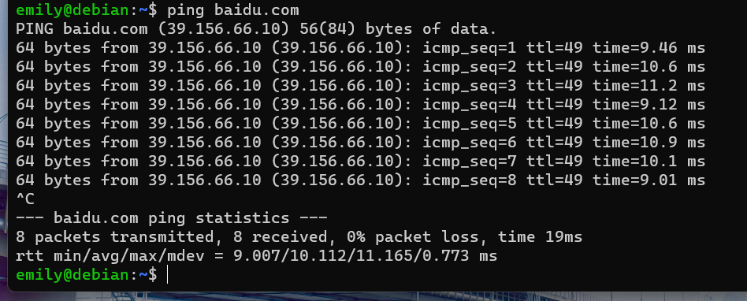   

 ## 实验问题及解决
 问题：网关无法访问靶机xp-sp3
 解决：关闭靶机xp-sp3防火墙设置
 ## 参考资料
 [畅课1.12](http://courses.cuc.edu.cn/course/90732/learning-activity/full-screen#/378195)
