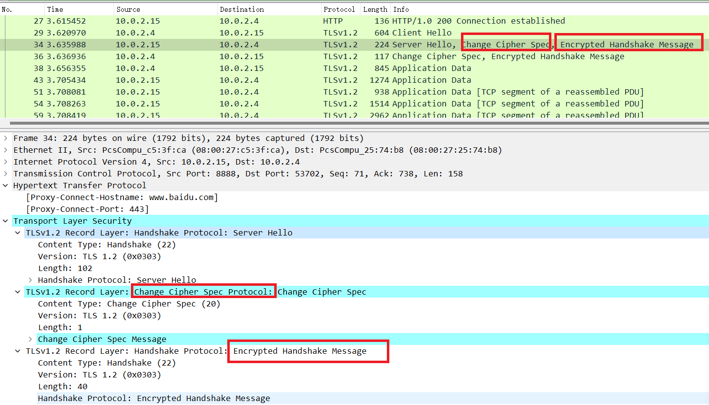

# 第三章实验：HTTP代理服务器实验

## 实验要求

- 网关安装 tinyproxy  
- 用主机设置浏览器代理指向 tinyproxy 建立的 HTTP 正向代理  
- 在 Kali 中用 wireshark 抓包  
- 分析抓包过程，理解 HTTP 正向代理 HTTPS 流量的特点  

## 实验环境

- Kali(attacker & victim)  
- debian(gateway)  
- tinyproxy  
- wireshark  


## 实验步骤

### 搭建实验所需网络拓扑

  

### 在网关安装配置 tinyproxy
```
# 安装 tinyproxy  
apt-get update
apt-get install tinyproxy
# 备份tinyproxy配置文件
cp /etc/tinyproxy/tinyproxy.conf /etc/tinyproxy/tinyproxy.conf.bak
# 编辑tinyproxy配置文件#
# 编辑tinyproxy，取消Allow 10.0.0.0/8行首注释
vim /etc/tinyproxy/tinyproxy.conf
# 开启tinyproxy服务
systemctl restart tinyproxy
#查看tinyproxy服务状态
systemctl status tinyproxy.service
```
- 允许该网段使用网关为代理服务器

  

### 在攻击者主机的浏览器配置代理服务

默认tinyproxy监听8888端口    

  

### 在靶机上开启 web 服务
```
cd /var/www/html
sudo touch server.php
sudo vim server.php
# vim内容
<?php
var_dump($_SERVER);
# 编辑结束
php -S 0.0.0.0:8080
```

  

### 使用 tinyproxy 访问靶机

- 在攻击者的浏览器上配置并启用代理服务器后，同时在攻击者、网关、靶机开启抓包  

- 攻击者主机  
访问靶机 172.16.111.139 成功   

  

用 wireshark 查看抓到的包，过滤掉不必要的信息后，可以发现 HTTP 响应里有 `Proxy-agent:tinyproxy/1.10.0\r\n`  
 
  

- 网关  
    wireshark 抓包分析，发现 HTTP 响应里含有`Via: 1.1 tinyproxy (tinyproxy/1.10.0)`字段  

  

  

- 靶机

   使用 wireshark 进行抓包分析，发现 HTTP 响应里含有`Via: 1.1 tinyproxy (tinyproxy/1.10.0)`字段  

  

在 HTTP 协议中可以看到出现`Via: 1.1 tinyproxy (tinyproxy/1.10.0)`字段，说明此时网关（即代理服务器）正在提供代理服务  

#### 在攻击者主机上访问https页面

在攻击者主机上用 firefox 访问 https://www.baidu.com，同时在网关上进行抓包  

之前使用 http 协议访问靶机时，代理服务器（即网关）可以直接看到用户访问的网址，HTTP请求和响应的信息都是以明文形式展现  

使用https，代理服务器（即网关）能看到用户访问的网址，但是传输的数据被加密了。从抓到的数据包来看，用户和目标网站的通信都进行了加密  
  

  

  

因此，通过代理服务器可以绕过某些访问限制，代理服务器可以看到用户访问的网址代理服务器，无法看到 https 通信数据，但是存在实现中间人攻击的可能。  

## 问题及解决
- 问题

   攻击者主机访问靶机（172.16.111.139）时出现 Unable to connect  

  

- 解决

    查找进程发现靶机的Apache服务是关闭的，使用命令`service apache2 start`开启服务  

  


## 参考

[tinyproxy](https://tinyproxy.github.io/)  
[在线课本第三章](https://c4pr1c3.github.io/cuc-ns/chap0x03/main.html)  

