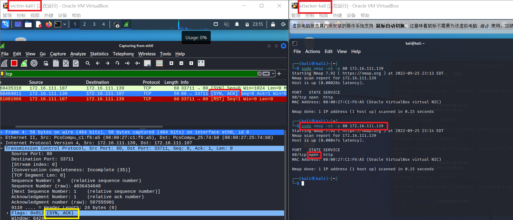
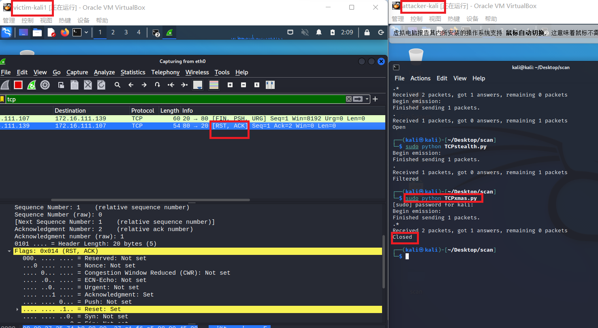
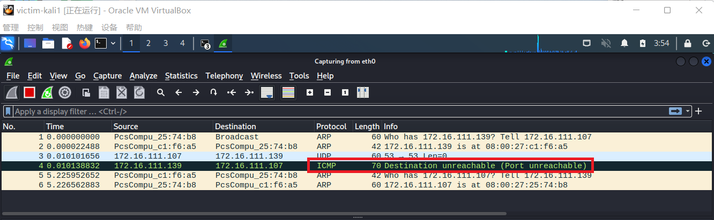
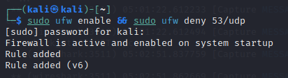

# 基于 Scapy 编写端口扫描器

## 实验目的

- 掌握网络扫描之端口状态探测的基本原理  

## 实验环境

- python + scapy  
- 网络拓扑  

    

## 实验要求

- 完成以下扫描技术的编程实现   
   - [x] TCP connect scan   
   - [x] TCP stealth scan    
   - [x] TCP Xmas scan   
   - [x] TCP fin scan  
   - [x] TCP null scan   
   - [x] UDP scan   
- 上述每种扫描技术的实现测试均需要测试端口状态为：开放、关闭和过滤状态时的程序执行结果  
- 提供每一次扫描测试的抓包结果并分析与课本中的扫描方法原理是否相符？如果不同，试分析原因  
- 在实验报告中详细说明实验网络环境拓扑、被测试 IP 的端口状态是如何模拟的  

## 实验过程

### TCP connect scan  


端口状态 | 应该接收到的数据包| 实验结果否相符
 :-:     |:-:       |:-:
开放 |SYN/ACK|是
关闭| RST/ACK|是
过滤|没有响应|是
       


```python
# TCPconnect.py
from scapy.all import *
def tcpconnect(dst_ip,dst_port,timeout=10):
    pkts=sr1(IP(dst=dst_ip)/TCP(dport=dst_port,flags="S"),timeout=timeout)# 构造SYN包，flags='S'表示为SYN包
    if (pkts is None):
        print("FILTER")
    elif(pkts.haslayer(TCP)):
        if(pkts[1].flags=='AS'): # 收到的第一个包为回来的tcp包，若为ACK包，则表示处于开放状态
            print("OPEN")
        elif(pkts[1].flags=='AR'): # 若收到的第一个包为RST包，则表示为开放状态
                print("CLOSE")
tcpconnect('172.16.111.142',80)
```

#### closed

提前检查靶机端口状态  

  

攻击者主机运行 TCPconnect.py 脚本  

   
 
靶机 Wireshark 抓包结果   

   

攻击者主机向靶机发送连接请求，靶机相应端口处于关闭状态，靶机将会向攻击者返回[RST,ACK]数据包，抓包结果与扫描原理相符。  

#### open

`sudo systemctl start apache2`  

开启 apache2 服务从而开放 80 端口  

攻击者主机运行 TCPconnect.py 脚本  

  

靶机 Wireshark 抓包结果  

  

攻击者主机向靶机发送连接请求，靶机相应端口处于开启状态，收到靶机返回[SYN/ACK]数据包，抓包结果与扫描原理相符。  

#### filtered

靶机添加规则过滤 80 端口  

`sudo ufw enable && sudo ufw deny 80/tcp`  

  

攻击者主机运行 TCPconnect.py 脚本  

靶机 Wireshark 抓包结果  

  

攻击者主机向靶机发送连接请求，靶机相应端口处于过滤状态，没有得到任何响应，抓包结果与扫描原理相符。  

#### nmap 复刻

`sudo nmap -sT -p 80 172.16.111.139`  

- closed  
  
     

- open  
  
    

- filtered  
  
    
 

### TCP stealth scan

端口状态 | 应该接收到的数据包| 实验结果否相符
 :-:     |:-:       |:-:
开放 |SYN/ACK|是
关闭| RST/ACK|是
过滤|没有响应|是


```python
from scapy.all import *
def tcpstealthscan(dst_ip , dst_port , timeout = 10):
    pkts = sr1(IP(dst=dst_ip)/TCP(dport=dst_port,flags="S"),timeout=10) # 构造SYN包
    if (pkts is None):
        print ("Filtered")
    elif(pkts.haslayer(TCP)):
        if(pkts.getlayer(TCP).flags == 0x12):
            send_rst = sr(IP(dst=dst_ip)/TCP(dport=dst_port,flags="R"),timeout=10)
            print ("Open")
        elif (pkts.getlayer(TCP).flags == 0x14):
            print ("Closed")
        elif(pkts.haslayer(ICMP)):
            if(int(pkts.getlayer(ICMP).type)==3 and int(stealth_scan_resp.getlayer(ICMP).code) in [1,2,3,9,10,13]):
                print ("Filtered")
tcpstealthscan('172.16.111.139',80)
```
#### closed 

攻击者主机运行 TCPstealth.py 脚本  

  

靶机 Wireshark 抓包结果  

  

攻击者主机向靶机发送连接请求，靶机相应端口处于关闭状态，靶机将会向攻击者返回[RST,ACK]数据包，抓包结果与扫描原理相符。  

#### open

`sudo systemctl start apache2`  

开启 apache2 服务从而开放 80 端口  

攻击者主机运行 TCPstealth.py 脚本  

  

靶机 Wireshark 抓包结果  

  

攻击者主机向靶机发送连接请求，靶机相应端口处于开启状态，收到靶机返回[SYN/ACK]数据包，抓包结果与扫描原理相符。  

#### filtered

靶机添加规则过滤 80 端口  

`sudo ufw enable && sudo ufw deny 80/tcp`  

  

攻击者主机运行 TCPstealth.py 脚本  

靶机 Wireshark 抓包结果  

  

攻击者主机向靶机发送连接请求，靶机相应端口处于过滤状态，没有得到任何响应，抓包结果与扫描原理相符。  

#### nmap 复刻  

`sudo nmap -sS -p 80 172.16.111.139`   

- closed
   
     

     

- open
  
    

    

- filtered
  
    

     


### TCP Xmas scan

Xmas 发送一个 TCP 包，并对 TCP 报文头 FIN、URG 和 PUSH 标记进行设置。若是关闭的端口则响应 RST 报文；开放或过滤状态下的端口则无任何响应。优点是隐蔽性好，缺点是需要自己构造数据包，要求拥有超级用户或者授权用户权限。  

端口状态 | 应该接收到的数据包| 实验结果否相符
 :-:     |:-:       |:-:
开放 |没有响应|是
关闭| RST|是
过滤|没有响应|是
       

```python
#TCPxmas.py
from scapy.all import *
def Xmasscan(dst_ip , dst_port , timeout = 10):
    pkts = sr1(IP(dst=dst_ip)/TCP(dport=dst_port,flags="FPU"),timeout=10)# 发送FIN,PUSH,URG
    if (pkts is None): # 未收到任何包可能为这两种状态
        print ("Open|Filtered")
    elif(pkts.haslayer(TCP)):
        if(pkts.getlayer(TCP).flags == 0x14):
            print ("Closed") # 收到RST包即为端口关闭状态
    elif(pkts.haslayer(ICMP)):
        if(int(pkts.getlayer(ICMP).type)==3 and int(pkts.getlayer(ICMP).code) in [1,2,3,9,10,13]):
            print ("Filtered")
Xmasscan('172.16.111.139',80)
```

#### closed

攻击者主机运行 TCPxmas.py 脚本  
显示靶机 Wireshark 抓包结果  
 
  

攻击者主机向靶机发送连接请求，靶机相应端口处于关闭状态，靶机将会响应 RST 报文，抓包结果与扫描原理相符。  

#### open

`sudo systemctl start apache2`  

开启 apache2 服务 开放 80 端口   

攻击者主机运行 TCPxmas.py 脚本  
显示靶机 Wireshark 抓包结果  

  

攻击者主机向靶机发送连接请求，靶机相应端口处于开启状态，开放状态下的端口无任何响应，抓包结果与扫描原理相符。  

#### filtered

靶机添加规则过滤 80 端口  

`sudo ufw enable && sudo ufw deny 80/tcp`  

   

攻击者主机运行 TCPxmas.py 脚本  

  
 
靶机 Wireshark 抓包结果  

   

攻击者主机向靶机发送连接请求，靶机相应端口处于过滤状态，没有得到任何响应，抓包结果与扫描原理相符。  

#### nmap 复刻

`sudo nmap -sX -p 80 172.16.111.139`  

- closed  

     

- open  

    

    

- filtered

     

    
  

### TCP FIN scan

仅发送 FIN 包，它可以直接通过防火墙，如果端口是关闭的就会回复一个 RST 包，如果端口是开放或过滤状态则对 FIN 包没有任何响应。
其优点是 FIN 数据包能够通过只监测 SYN 包的包过滤器，且隐蔽性高于 SYN 扫描。缺点和 SYN 扫描类似，需要自己构造数据包，要求由超级用户或者授权用户访问专门的系统调用。  

端口状态 | 应该接收到的数据包| 实验结果否相符
 :-:     |:-:       |:-:
开放 |没有响应|是
关闭| RST|是
过滤|没有响应|是
       

```python
#TCPfin.py
from scapy.all import *
def fin_scan(dst_ip , dst_port , timeout = 10):
    pkts = sr1(IP(dst=dst_ip)/TCP(dport=dst_port,flags="F"),timeout=10)#发送FIN包
    if (pkts is None):#未收到任何包可能为这两种状态
        print ("Open|Filtered")
    elif(pkts.haslayer(TCP)):
        if(pkts.getlayer(TCP).flags == 0x14):
            print ("Closed")#收到RST包即为端口关闭状态
    elif(pkts.haslayer(ICMP)):
        if(int(pkts.getlayer(ICMP).type)==3 and int(pkts.getlayer(ICMP).code) in [1,2,3,9,10,13]):
            print ("Filtered")
fin_scan('172.16.111.139',80)
```

#### closed

攻击者主机运行 TCPfin.py 脚本  
显示靶机 Wireshark 抓包结果  

   

攻击者主机向靶机发送连接请求，靶机相应端口处于关闭状态，靶机将会响应 RST 报文，抓包结果与扫描原理相符。  

#### open

`sudo systemctl start apache2`  

开启 apache2 服务 开放 80 端口  

攻击者主机运行 TCPfin.py 脚本  
显示靶机 Wireshark 抓包结果  

  

攻击者主机向靶机发送连接请求，靶机相应端口处于开启状态，开放状态下的端口无任何响应，抓包结果与扫描原理相符。     

#### filtered

靶机添加规则过滤 80 端口  

`sudo ufw enable && sudo ufw deny 80/tcp`  

  

攻击者主机运行 TCPfin.py 脚本  
靶机 Wireshark 抓包结果  

  

攻击者主机向靶机发送连接请求，靶机相应端口处于过滤状态，没有得到任何响应，抓包结果与扫描原理相符。  

#### nmap 复刻

`sudo nmap -sF -p 80 172.16.111.139`  

- closed

     

     

- open  

    

    
 

- filtered  

    


### TCP NULL scan  

发送一个 TCP 数据包，关闭所有 TCP 报文头标记。只有关闭的端口会发送 RST 响应。其优点和 Xmas 一样是隐蔽性好，缺点也是需要自己构造数据包，要求拥有超级用户或者授权用户权限。  

端口状态 | 应该接收到的数据包| 实验结果否相符
 :-:     |:-:       |:-:
开放 |没有响应|是
关闭| RST|是
过滤|没有响应|是
       

```python
#TCPnull.py
from scapy.all import *
def nullscan(dst_ip , dst_port , timeout = 10):
    pkts = sr1(IP(dst=dst_ip)/TCP(dport=dst_port,flags=""),timeout=10)
    if (pkts is None): # 未收到任何包可能为这两种状态
        print ("Open|Filtered")
    elif(pkts.haslayer(TCP)):
        if(pkts.getlayer(TCP).flags == 0x14):
            print ("Closed") # 收到RST包即为端口关闭状态
    elif(pkts.haslayer(ICMP)):
        if(int(pkts.getlayer(ICMP).type)==3 and int(pkts.getlayer(ICMP).code) in [1,2,3,9,10,13]):
            print ("Filtered")
nullscan('172.16.111.142',80)
```

#### closed

攻击者主机运行 TCPnull.py 脚本  
显示靶机 Wireshark 抓包结果  

   

攻击者主机向靶机发送连接请求，靶机相应端口处于关闭状态，靶机将会响应 RST 报文，抓包结果与扫描原理相符。   

#### open

`sudo systemctl start apache2`   

开启 apache2 服务 开放 80 端口   

攻击者主机运行 TCPfin.py 脚本  
显示靶机 Wireshark 抓包结果  

  

攻击者主机向靶机发送连接请求，靶机相应端口处于开启状态，开放状态下的端口无任何响应，抓包结果与扫描原理相符。  

#### filtered

靶机添加规则过滤 80 端口  

`sudo ufw enable && sudo ufw deny 80/tcp`  

  

攻击者主机运行 TCPfin.py 脚本 
靶机 Wireshark 抓包结果  
 
  

攻击者主机向靶机发送连接请求，靶机相应端口处于过滤状态，没有得到任何响应，抓包结果与扫描原理相符。  

#### nmap 复刻  

`sudo nmap -sN -p 80 172.16.111.139`  

- closed  

     

- open  

    
 
- filtered  

    


### UDP scan

UDP 是一个无链接的协议，当我们向目标主机的 UDP 端口发送数据，我们并不能收到一个开放端口的确认信息，或是关闭端口的错误信息。可是，在大多数情况下，当向一个未开放的 UDP 端口发送数据时，其主机就会返回一个 ICMP 不可到达 (ICMP_PORT_UNREACHABLE) 的错误，因此大多数 UDP 端口扫描的方法就是向各个被扫描的 UDP 端口发送零字节的 UDP 数据包，如果收到一个 ICMP 不可到达的回应，那么则认为这个端口是关闭的，对于没有回应的端口则认为是开放的，但是如果目标主机安装有防火墙或其它可以过滤数据包的软硬件，那我们发出 UDP 数据包后，将可能得不到任何回应，我们将会见到所有的被扫描端口都是开放的。  

端口状态 | 应该接收到的数据包| 实验结果否相符
 :-:     |:-:       |:-:
开放 |没有响应 |是
关闭| ICMP 不可到达 |是
过滤|没有响应|是
       

```python
#UDP.py
from scapy.all import *
def udpscan(dst_ip,dst_port,dst_timeout = 10):
    # 发送UDP包
    resp = sr1(IP(dst=dst_ip)/UDP(dport=dst_port),timeout=dst_timeout)
    # 未收到UDP回复即为open/filter
    if (resp is None):
        print("Open|Filtered")
    # 收到UDP回复则为开启状态
    elif (resp.haslayer(UDP)):
        print("Open")
    elif(resp.haslayer(ICMP)):
        #the server responds with an ICMP port unreachable error type 3 and code 3, meaning that the port is closed on the server.
        if(int(resp.getlayer(ICMP).type)==3 and int(resp.getlayer(ICMP).code)==3):
            print("Closed")
         #If the server responds to the client with an ICMP error type 3 and code 1, 2, 9, 10, or 13, then that port on the server is filtered.
        elif(int(resp.getlayer(ICMP).type)==3 and int(resp.getlayer(ICMP).code) in [1,2,9,10,13]):
            print("Filtered")
        elif(resp.haslayer(IP) and resp.getlayer(IP).proto==IP_PROTOS.udp):
            print("Open")
udpscan('172.16.111.139',53)
```

#### closed

`systemctl stop dnsmasq`  
关闭端口并检查端口状态  

  

攻击者主机运行 UDP.py 脚本  

  

显示靶机 Wireshark 抓包结果  

  

UDP扫描属于开放式扫描，靶机 udp/53 端口关闭状态下，对攻击者主机并无任何响应，没有收到UDP回复包，抓包结果与预期结果一致  

#### open

`systemctl start dnsmasq`  

开启 dnsmasq 服务 开放 53 端口  

攻击者主机运行 UDP.py 脚本  

  

显示靶机 Wireshark 抓包结果  

  

攻击者主机向靶机发送连接请求，靶机相应端口处于开启状态，开放状态下的端口无任何响应，无法判断被过滤或开启，抓包结果与扫描原理相符。  

#### filtered  

靶机添加规则过滤 53 端口  

`sudo ufw enable && sudo ufw deny 53/udp`  

  

攻击者主机运行 UDP.py 脚本   

   
 
靶机 Wireshark 抓包结果   

   

攻击者主机向靶机发送连接请求，靶机相应端口处于过滤状态，开放状态下的端口无任何响应，无法判断被过滤或开启，抓包结果与扫描原理相符。   

#### nmap 复刻  

`sudo nmap -sU -p 53 172.16.111.139`   

- closed  

      

- open   

     
 
- filtered 

    

## 参考资料
[在线课本第五章网络扫描](https://c4pr1c3.github.io/cuc-ns/chap0x05/main.html)  
[namp-scan-methods](https://nmap.org/book/scan-methods-null-fin-xmas-scan.html)  
[port-scanning-techniques](https://nmap.org/book/man-port-scanning-techniques.html)  
[Port Scanning Basics](https://www.uv.mx/personal/angelperez/files/2018/10/scanning_texto.pdf)  
